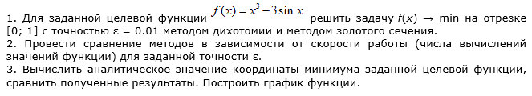
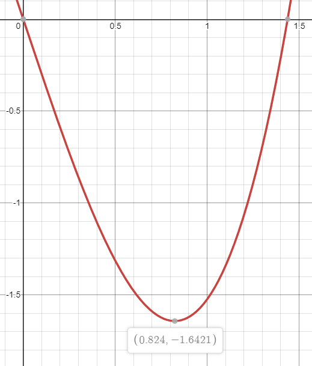

# Лабораторная работа №1. Прямые методы оптимизации одной переменной

## Задача

## Результаты
- Метод дихотомии
    - Количество вычислений: 20
    - Минимальное значение: f(0.82373046875)=-1.642129835985283

- Метод золотого сечения
    - Количество вычислений: 17
    - Минимальное значение: f(0.8087646247994515)=-1.641291380251132

Графическое решение

