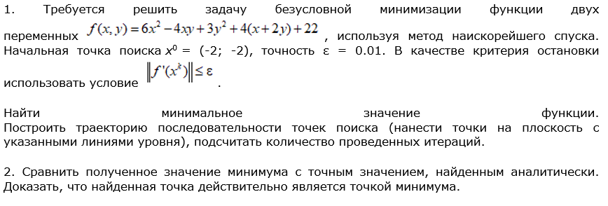
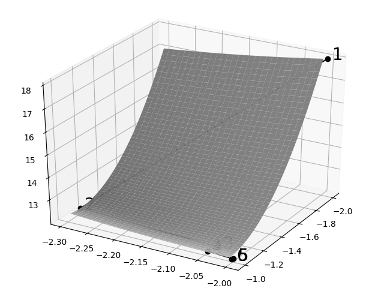
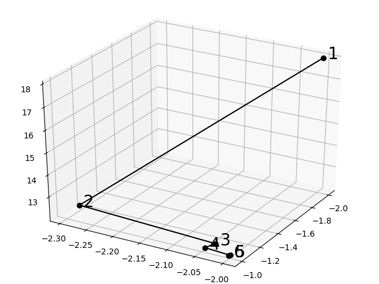

# Лабораторная работа №3. Градиентные методы оптимизации

## Задача

## Результаты
f(-1.0, -2.0) = 12.0

Количество итераций: 6 

## Проверка
В результате решения аналитическим способом минимум также нашелся в точке (-1;-2). 

z(-1;-2) = 12; 
