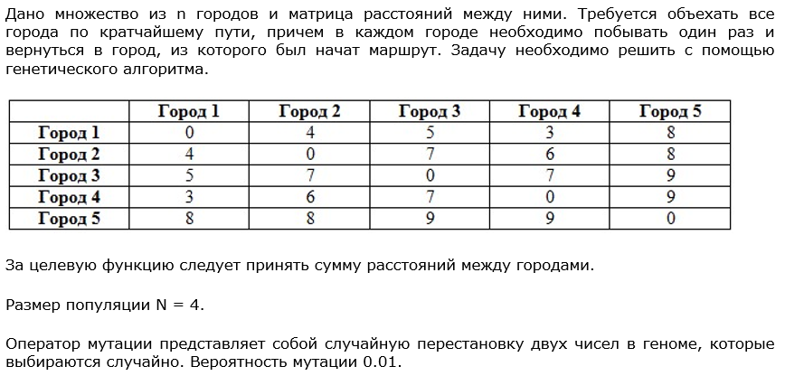

# Лабораторная работа №4. Решение задачи коммивояжера с помощью генетического алгоритма

## Задача


## Решение
Так как требуется найти кратчайший путь, который будет проходить через все города единожды и замыкаться на исходном городе, представим путь как набор номеров городов, в которых мы побывали на этом пути.
Тогда первый и последний номера будут всегда совпадать.
Будем называть такое представление геномом особи (набор хромосом – городов). 
И поскольку не важно, из какого города мы начнем путь, всегда будем начинать с первого. 
Качество особи будем определять по длине пути, представленного ее геномом. 
Чем меньше путь, тем лучше особь. 

Организуем популяцию особей из возможных путей и понаблюдаем за ее эволюцией. 
Каждое последующее поколение, согласно законам эволюции, должно становиться лучше. 
Так мы придем к оптимальному набору генов в особи, а значит к оптимальному пути.
Создадим класс Особь со статическим полем матрицы длин путей и полями со списком хромосом (генома) и весом особи (рассчитывается из первых двух полей). 
Методы класса Особь: скрещивание и мутация.

```
class Specimen:
    paths = [[0, 4, 5, 3, 8],
             [4, 0, 7, 6, 8],
             [5, 7, 0, 7, 9],
             [3, 6, 7, 0, 9],
             [8, 8, 9, 9, 0]]

    genome = []
    weight = 0

#...some code…#

    def crossing(self, partner):
        parent1 = self.genome[1:len(self.genome)-1]
        parent2 = partner.genome[1:len(self.genome)-1]

        def remove_same_elms(elms_to_remove, list_to_clean):
            for elem in elms_to_remove:
                while elem in list_to_clean:
                    list_to_clean.remove(elem)
            return list_to_clean

        length = len(parent1)
        point1 = length // 3
        point2 = length - point1
        elms_to_offspring1 = remove_same_elms(parent1[point1:point2], parent2[point2:] + parent2[:point2])
        elms_to_offspring2 = remove_same_elms(parent2[point1:point2], parent1[point2:] + parent1[:point2])
        offspring1 = Specimen([self.genome[0]] + elms_to_offspring1[:point1] + parent1[point1:point2] + elms_to_offspring1[point1:] + [self.genome[0]])
        offspring2 = Specimen([self.genome[0]] + elms_to_offspring2[:point1] + parent2[point1:point2] + elms_to_offspring2[point1:] + [self.genome[0]])
        return offspring1, offspring2

    def mutation(self, probability):
        for i in range(1, len(self.genome) - 2):
            for j in range(2, len(self.genome) - 1):
                if probability > random.random():
                    self.genome[i], self.genome[j] = self.genome[j], self.genome[i]

```
При скрещивании из двух родителей будем получать двух потомков. 
Алгоритм: 
- делим списки хромосом родителей одинаковым образом на 3 части;
- центральная часть первого родителя достанется первому потомку, центральная часть второго родителя – второму потомку;
- далее собираем недостающие хромосомы в списки для первого потомка из второго родителя, начиная с третей части. Аналогично для второго потомка из первого родителя;
- заполняем пустые места в геномах потомков хромосомами из полученных списков слева направо.

Мутация особи происходит перебором каждой пары хромосом в геноме. 
Генерируется число от 0 до 1, и, если вероятность мутации оказалась больше этого числа, хромосомы меняются местами.

Теперь создадим класс Популяция с полями: вероятность мутации, численность популяции и список особей популяции. 
Создадим метод, обновляющий популяцию следующим поколением.

```
class Population:
    mutation_probability = 0
    population_num = 0
    specimens = []

#...some code…#

    def next_generation(self):
        self.specimens.sort()
        new_specimens = []

        def doubled():
            return len(new_specimens) >= Population.population_num * 2

        for i in range(len(self.specimens)):
            for j in range(1, len(self.specimens) - 1):
                s1, s2 = self.specimens[i].crossing(self.specimens[j])
                s1.mutation(Population.mutation_probability)
                s2.mutation(Population.mutation_probability)
                new_specimens.append(s1)
                new_specimens.append(s2)
                if doubled():
                    break
            if doubled():
                break

        new_specimens.sort()
        self.specimens = new_specimens[:Population.population_num]
```

Смена поколения будет происходить следующим образом:
- особи сортируются по полю веса;
- скрещиваем каждую пару по порядку и вызываем мутацию у каждой полученной особи, пока количество потомков не станет больше количества родителей в 2 раза;
- сортируем потомков;
- обновляем текущее поколение первой половиной полученных потомков.

Первое поколение зададим со случайными геномами:
```
population = Population(mutation_probability, population_num)
for i in range(population_num):
    rand_genome = [j for j in range(1, len(Specimen.paths))]
    random.shuffle(rand_genome)
    rand_genome.insert(0, 0)
    rand_genome.append(0)
    population.specimens.append(Specimen(rand_genome))
```

Смоделируем 3 поколения
```
# Поколение 1:
# {'genome': [0, 2, 4, 1, 3, 0], 'weight': 31}
# {'genome': [0, 3, 2, 4, 1, 0], 'weight': 31}
# {'genome': [0, 2, 3, 4, 1, 0], 'weight': 33}
# {'genome': [0, 4, 3, 1, 2, 0], 'weight': 35}
#
# Поколение 2:
# {'genome': [0, 3, 2, 4, 1, 0], 'weight': 31}
# {'genome': [0, 2, 4, 1, 3, 0], 'weight': 31}
# {'genome': [0, 3, 4, 1, 2, 0], 'weight': 32}
# {'genome': [0, 1, 2, 4, 3, 0], 'weight': 32}
#
# Поколение 3:
# {'genome': [0, 3, 2, 4, 1, 0], 'weight': 31}
# {'genome': [0, 3, 2, 4, 1, 0], 'weight': 31}
# {'genome': [0, 2, 4, 1, 3, 0], 'weight': 31}
# {'genome': [0, 3, 4, 1, 2, 0], 'weight': 32}
#
# Оптимальный путь: [0, 3, 2, 4, 1, 0] длиной 31
```

## Анализ результатов
Для проверки результата составим выборку всех возможных путей и выберем наименьший:
```
population = []
perm = list(permutations([i for i in range(1, len(Specimen.paths))]))
for i in perm:
    population.append(Specimen([0] + list(i) + [0]))
best_specimen = min(population)
```
Получаем:
```
# Оптимальный путь: [0, 1, 4, 2, 3, 0] длиной 31
```